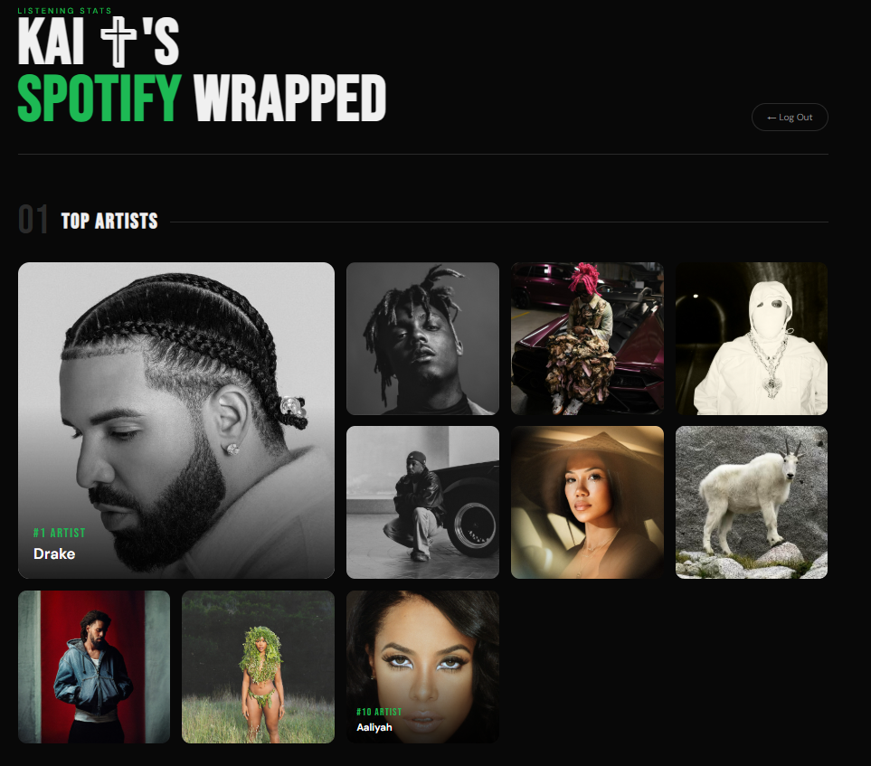
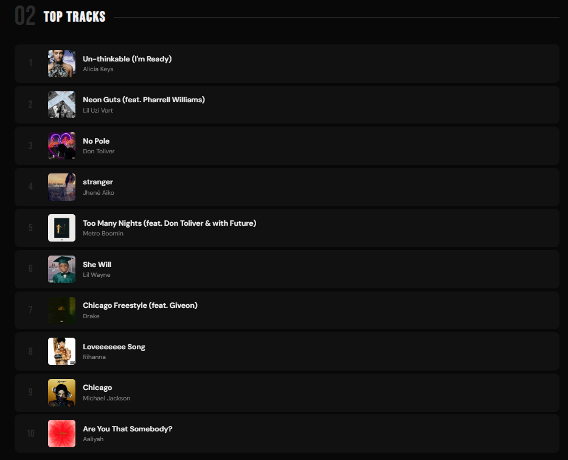

# 🎵 Spotify Analytics Dashboard

A full-stack web app that lets anyone log in with their Spotify account and view their personalized listening stats — top artists and tracks from the last 6 months.

🔗 **Live Demo: [spotify-analytics-llfs.onrender.com](https://spotify-analytics-llfs.onrender.com)**




---

## Features

- Spotify OAuth 2.0 login — works for any Spotify user
- Displays your top 10 artists with photos in a mosaic layout
- Displays your top 10 tracks with album artwork
- Pulls live data directly from the Spotify Web API
- Sleek dark UI with animations and hover effects

---

## Tech Stack

| Layer | Technology |
|-------|------------|
| Backend | Python, Flask |
| Spotify Integration | Spotipy, Spotify Web API |
| Frontend | HTML, CSS, Jinja2 |
| Deployment | Render |

---

## How to Run Locally

1. Clone the repo ```git clone https://github.com/malachiwinder/spotify-analytics.git cd spotify-analytics```

3. Install dependencies
```pip install -r requirements.txt```

4. Create a Spotify app at [developer.spotify.com](https://developer.spotify.com) and grab your Client ID and Secret

5. Add a Redirect URI in your Spotify app settings:
http://127.0.0.1:5000/callback

6. Set your environment variables. Create a file called `.env` in the project root:
- ```CLIENT_ID = your_client_id```
- ```CLIENT_SECRET = your_client_secret```
- ```REDIRECT_URI = http://127.0.0.1:5000/callback```
- ```SECRET_KEY = any_random_string```

7. Run the app
```python app.py```

8. Visit `http://127.0.0.1:5000` and log in with Spotify

---

## Project Structure
```
spotify-analytics/
├── app.py               # Flask app, routes, Spotify API logic
├── requirements.txt     # Python dependencies
└── templates/
    ├── index.html       # Login page
    └── dashboard.html   # Stats dashboard
```

---

## What I Learned

- Implementing OAuth 2.0 authentication with the Spotify Web API
- Building and deploying a full-stack Python web app with Flask
- Processing and displaying live API data with Jinja2 templating
- Deploying a production app with secure environment variable management

---

## Future Features

- [ ] Time range toggle (last 4 weeks / 6 months / all time)
- [ ] Genre breakdown chart
- [ ] Recently played tracks
- [ ] Share your stats as an image

---

Built by [Malachi Winder](https://github.com/malachiwinder) — CS student at San Diego State University

Connect with me on [LinkedIn](https://linkedin.com/in/malachi-winder)
